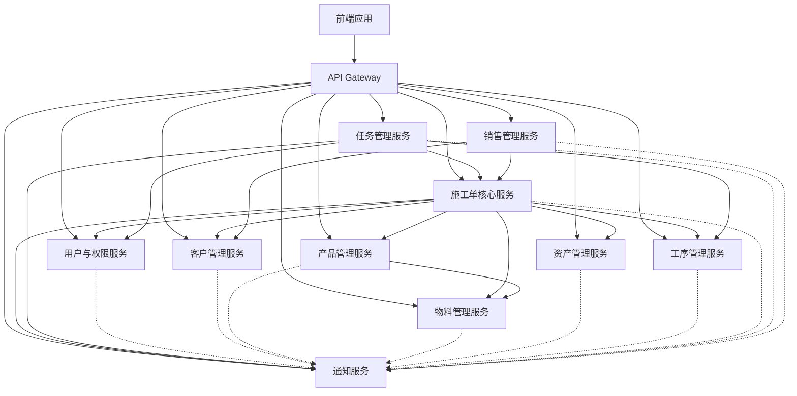

# P2 优化任务 3: 微服务架构准备 - 架构分析与规划

## 📋 任务概述

**任务名称**: P2优化任务3: 微服务架构准备 - 分析和规划架构演进  
**创建时间**: 2026-01-17  
**任务状态**: 🔄 进行中  
**优先级**: 中等  

## 🎯 任务目标

分析当前单体架构，为印刷施工单跟踪系统的微服务架构演进制定详细规划和准备工作。

## 🔍 当前架构分析

### 1. 当前单体架构概览

#### 1.1 技术栈
- **后端**: Django 4.2 + Django REST Framework 3.14
- **数据库**: SQLite (开发) / PostgreSQL/MySQL (生产)
- **前端**: Vue 2.7 + Element UI
- **缓存**: Redis (已实现)
- **监控**: 自研性能监控系统 (P2 Task 2已完成)

#### 1.2 业务域划分

基于现有的模型结构，系统已按业务域进行了模块化拆分：

```
workorder/models/
├── base.py          # 基础管理域
├── products.py       # 产品管理域  
├── materials.py      # 物料管理域
├── assets.py         # 资产管理域
├── core.py          # 核心业务域
├── system.py        # 系统管理域
└── sales.py         # 销售管理域
```

#### 1.3 业务域详细分析

##### 🔷 基础管理域 (base.py)
**核心实体**: Customer, Department, Process, UserProfile
- **Customer**: 客户信息管理
- **Department**: 部门层级管理  
- **Process**: 工序定义管理
- **UserProfile**: 用户扩展信息

**业务特点**:
- 相对稳定的数据
- 跨域引用较多
- 修改频率较低

##### 🔷 产品管理域 (products.py)
**核心实体**: Product, ProductGroup, ProductMaterial, ProductStockLog
- **Product**: 产品信息
- **ProductGroup**: 产品组(套装)
- **ProductMaterial**: 产品-物料关联
- **ProductStockLog**: 库存日志

**业务特点**:
- 中等修改频率
- 与物料域紧密关联
- 价格、规格经常变更

##### 🔷 物料管理域 (materials.py)
**核心实体**: Material, Supplier, MaterialSupplier, PurchaseOrder
- **Material**: 物料基础信息
- **Supplier**: 供应商管理
- **MaterialSupplier**: 供应商-物料关联
- **PurchaseOrder**: 采购订单

**业务特点**:
- 高频操作
- 与产品域双向依赖
- 库存管理复杂

##### 🔷 资产管理域 (assets.py)
**核心实体**: Artwork, Die, FoilingPlate, EmbossingPlate
- **Artwork**: 图稿管理
- **Die**: 刀模管理
- **FoilingPlate**: 烫金版管理
- **EmbossingPlate**: 压凸版管理

**业务特点**:
- 文件管理密集
- 版本控制重要
- 与产品多对多关联

##### 🔷 核心业务域 (core.py)
**核心实体**: WorkOrder, WorkOrderProcess, WorkOrderTask
- **WorkOrder**: 施工单核心
- **WorkOrderProcess**: 施工单工序
- **WorkOrderTask**: 施工单任务
- **ProcessLog**: 工序日志
- **TaskLog**: 任务日志

**业务特点**:
- 核心业务流程
- 高并发写入
- 状态管理复杂
- 跨域数据聚合最多

##### 🔷 系统管理域 (system.py)
**核心实体**: WorkOrderApprovalLog, Notification, TaskAssignmentRule
- **WorkOrderApprovalLog**: 审核日志
- **Notification**: 通知系统
- **TaskAssignmentRule**: 任务分配规则

**业务特点**:
- 系统级功能
- 日志密集
- 与所有域交互

##### 🔷 销售管理域 (sales.py)
**核心实体**: SalesOrder, SalesOrderItem
- **SalesOrder**: 销售订单
- **SalesOrderItem**: 销售订单明细

**业务特点**:
- 与客户域紧密
- 与施工单域关联
- 财务数据集成

### 2. 当前架构的优势与挑战

#### 2.1 优势
✅ **已模块化**: 按业务域进行了良好的模块拆分  
✅ **职责清晰**: 每个模块职责边界明确  
✅ **数据完整**: 单数据库保证数据一致性  
✅ **开发效率高**: 内部调用无需网络开销  
✅ **事务支持**: 跨域事务易于实现  

#### 2.2 挑战
⚠️ **部署复杂**: 单体部署影响全系统  
⚠️ **扩展受限**: 无法独立扩展高负载域  
⚠️ **技术栈锁定**: Django技术栈难以局部升级  
⚠️ **故障影响**: 单点故障影响全系统  
⚠️ **团队协作**: 多团队开发容易冲突  

## 🏗️ 微服务架构规划

### 3. 服务划分策略

#### 3.1 领域驱动设计 (DDD) 原则

基于当前业务分析，建议采用以下微服务划分：

##### 🟢 用户与权限服务 (User & Auth Service)
```
负责范围：
- 用户认证与授权
- 用户信息管理
- 权限与角色管理
- 部门管理

数据实体：
- UserProfile
- Department  
- 相关权限表

API端点：
- /auth/login
- /auth/logout
- /auth/register
- /users/*
- /departments/*
```

##### 🟢 客户管理服务 (Customer Service)
```
负责范围：
- 客户信息管理
- 联系人管理
- 业务员关联

数据实体：
- Customer
- Contact (如独立存在)

API端点：
- /customers/*
- /contacts/*
```

##### 🟢 产品管理服务 (Product Service)
```
负责范围：
- 产品信息管理
- 产品组管理
- 产品配置管理

数据实体：
- Product
- ProductGroup
- ProductGroupItem

API端点：
- /products/*
- /product-groups/*
```

##### 🟢 物料管理服务 (Material Service)
```
负责范围：
- 物料信息管理
- 供应商管理
- 采购管理
- 库存管理

数据实体：
- Material
- Supplier
- MaterialSupplier
- PurchaseOrder
- PurchaseOrderItem
- ProductStockLog

API端点：
- /materials/*
- /suppliers/*
- /purchase-orders/*
```

##### 🟢 资产管理服务 (Asset Service)
```
负责范围：
- 图稿管理
- 刀模管理
- 烫金版管理
- 压凸版管理
- 文件存储

数据实体：
- Artwork
- Die
- FoilingPlate
- EmbossingPlate
- 关联表

API端点：
- /artworks/*
- /dies/*
- /foiling-plates/*
- /embossing-plates/*
```

##### 🟢 工序管理服务 (Process Service)
```
负责范围：
- 工序定义管理
- 工序模板管理
- 标准工时管理

数据实体：
- Process

API端点：
- /processes/*
```

##### 🟢 施工单核心服务 (Work Order Service)
```
负责范围：
- 施工单核心业务
- 施工单状态管理
- 施工单审核流程
- 业务规则实现

数据实体：
- WorkOrder
- WorkOrderApprovalLog

API端点：
- /workorders/*
- /workorder-approvals/*
```

##### 🟢 任务管理服务 (Task Service)
```
负责范围：
- 任务生成与管理
- 任务分配
- 任务执行跟踪
- 日志记录

数据实体：
- WorkOrderTask
- WorkOrderProcess
- ProcessLog
- TaskLog
- TaskAssignmentRule

API端点：
- /workorder-tasks/*
- /workorder-processes/*
- /process-logs/*
- /task-assignment-rules/*
```

##### 🟢 销售管理服务 (Sales Service)
```
负责范围：
- 销售订单管理
- 报价管理
- 客户关系管理

数据实体：
- SalesOrder
- SalesOrderItem

API端点：
- /sales-orders/*
```

##### 🟢 通知服务 (Notification Service)
```
负责范围：
- 系统通知
- 消息推送
- 邮件发送
- 事件通知

数据实体：
- Notification
- 事件日志

API端点：
- /notifications/*
- /events/*
```

#### 3.2 服务间依赖关系图



### 4. 数据架构设计

#### 4.1 数据库策略选择

考虑到当前系统的复杂性和数据一致性要求，建议采用 **混合数据库策略**：

##### 方案A: 数据库-per-服务 (推荐长期目标)
```
优点：
- 服务完全独立
- 技术栈灵活
- 独立扩展

挑战：
- 分布式事务复杂
- 数据一致性难保证
- 迁移成本高

适用场景：
- 系统规模较大
- 团队经验丰富
- 长期演进目标
```

##### 方案B: 共享数据库 + 逻辑分离 (推荐初始方案)
```
优点：
- 迁移成本较低
- 数据一致性容易保证
- 可以渐进式演进

挑战：
- 仍存在部分耦合
- 数据库成为瓶颈风险

适用场景：
- 微服务初期
- 团队经验有限
- 风险控制要求高
```

##### 方案C: 混合模式 (推荐中期方案)
```
核心服务: 数据库-per-服务
支撑服务: 共享数据库

实施策略：
1. 先拆分高独立性的服务 (用户、通知)
2. 逐步拆分核心业务服务
3. 最后处理高耦合的服务

优点：
- 渐进式演进
- 风险可控
- 兼顾灵活性和稳定性
```

#### 4.2 推荐数据架构

**第一阶段 (1-6个月)**:
```
共享数据库 + 服务逻辑分离
- 保持现有PostgreSQL数据库
- 各服务通过不同的schema或表前缀隔离
- 逐步拆分API接口

数据库分层：
users_db: 用户相关表
business_db: 业务核心表  
content_db: 内容管理表
```

**第二阶段 (6-12个月)**:
```
混合数据库架构
独立数据库：
- 用户权限服务
- 通知服务
- 资产管理服务

共享数据库：
- 施工单核心
- 产品物料
- 销售管理
```

**第三阶段 (12-24个月)**:
```
完全的数据库-per-服务
- 所有服务独立数据库
- 通过API Gateway统一访问
- 分布式事务管理
```

### 5. 技术架构设计

#### 5.1 技术栈选择

##### 后端技术栈
```
基础框架: Django + Django REST Framework (保持现有)
容器化: Docker + Docker Compose
API Gateway: Kong / Traefik
服务发现: Consul / Eureka
配置管理: Consul KV / Spring Cloud Config
消息队列: RabbitMQ / Apache Kafka
数据库: PostgreSQL / MongoDB (按服务特点选择)
缓存: Redis Cluster
监控: Prometheus + Grafana
日志: ELK Stack
```

##### 前端架构
```
保持现有Vue.js架构
通过API Gateway访问微服务
考虑升级到Vue 3
```

#### 5.2 服务间通信

##### 同步通信
```
REST API:
- 标准HTTP协议
- JSON数据格式
- 适合实时查询

gRPC:
- 高性能二进制协议
- 适合内部服务调用
- 支持流式传输

推荐：外部用REST，内部用gRPC
```

##### 异步通信
```
消息队列：
- RabbitMQ: 可靠消息传递
- Apache Kafka: 大数据量场景

事件驱动：
- Domain Events
- Event Sourcing (部分服务)
- CQRS (读写分离)

推荐：RabbitMQ + 事件驱动
```

### 6. 实施路线图

#### 6.1 第一阶段: 准备与基础建设 (1-3个月)

##### 🎯 目标
建立微服务基础设施，拆分低风险服务

##### ✅ 任务清单
- [ ] **基础设施准备**
  - [ ] Docker化现有应用
  - [ ] 搭建API Gateway
  - [ ] 建立CI/CD流水线
  - [ ] 搭建监控体系

- [ ] **服务拆分**
  - [ ] 用户权限服务拆分
  - [ ] 通知服务拆分
  - [ ] API Gateway配置

- [ ] **数据迁移**
  - [ ] 用户数据独立
  - [ ] 通知数据独立
  - [ ] 跨域访问接口

##### 📊 成功指标
- 用户服务独立运行
- 通知服务独立运行  
- API Gateway正常工作
- 监控体系覆盖新服务

#### 6.2 第二阶段: 核心服务拆分 (3-9个月)

##### 🎯 目标
拆分核心业务服务，建立服务间通信机制

##### ✅ 任务清单
- [ ] **服务拆分**
  - [ ] 客户管理服务
  - [ ] 产品管理服务
  - [ ] 物料管理服务

- [ ] **数据架构**
  - [ ] 部分服务独立数据库
  - [ ] 数据同步机制
  - [ ] 事务管理方案

- [ ] **服务通信**
  - [ ] 服务发现机制
  - [ ] 配置管理中心
  - [ ] 消息队列集成

##### 📊 成功指标
- 3个新服务独立运行
- 服务间通信稳定
- 数据一致性保证
- 性能不下降

#### 6.3 第三阶段: 高级功能完善 (9-18个月)

##### 🎯 目标
完善复杂服务，建立完整的微服务体系

##### ✅ 任务清单
- [ ] **复杂服务拆分**
  - [ ] 施工单核心服务
  - [ ] 任务管理服务
  - [ ] 资产管理服务

- [ ] **高级特性**
  - [ ] 分布式事务
  - [ ] 事件驱动架构
  - [ ] 智能负载均衡

- [ ] **运维体系**
  - [ ] 自动扩缩容
  - [ ] 故障自愈
  - [ ] 灰度发布

##### 📊 成功指标
- 所有服务微服务化
- 系统稳定性提升
- 扩展能力增强
- 运维效率提高

### 7. 风险分析与应对

#### 7.1 技术风险

##### ⚠️ 分布式事务复杂性
**风险**: 跨服务事务难以保证一致性  
**应对**: 
- 采用Saga模式
- 最终一致性设计
- 补偿机制实现

##### ⚠️ 服务间通信延迟
**风险**: 网络调用增加系统延迟  
**应对**:
- 服务聚合设计
- 缓存优化
- 异步处理

##### ⚠️ 数据一致性挑战
**风险**: 多数据库数据同步问题  
**应对**:
- 事件驱动更新
- CDC (Change Data Capture)
- 定期数据校验

#### 7.2 业务风险

##### ⚠️ 功能回归风险
**风险**: 拆分过程中功能丢失或异常  
**应对**:
- 完善测试覆盖
- 灰度发布
- 快速回滚机制

##### ⚠️ 性能下降风险
**风险**: 微服务调用影响性能  
**应对**:
- 性能基准测试
- 优化调用链路
- 缓存策略优化

#### 7.3 组织风险

##### ⚠️ 团队技能不足
**风险**: 微服务技术栈复杂，团队经验不够  
**应对**:
- 技术培训
- 引入专家指导
- 渐进式学习

##### ⚠️ 沟通成本增加
**风险**: 服务增多，团队协作复杂度上升  
**应对**:
- 建立清晰的API文档
- 服务负责人制度
- 定期技术分享

### 8. 成本效益分析

#### 8.1 成本估算

##### 技术成本
```
基础设施：
- 容器化平台: ¥50,000
- 监控工具: ¥30,000
- 负载均衡: ¥20,000
- 消息队列: ¥15,000

开发成本：
- 架构设计: ¥200,000
- 服务拆分: ¥500,000
- 测试验证: ¥150,000
- 文档培训: ¥100,000

总计技术成本: ¥1,065,000
```

##### 运维成本
```
人力成本：
- 运维工程师: 2人 × 24月 × ¥20,000 = ¥960,000
- DevOps工程师: 1人 × 24月 × ¥25,000 = ¥600,000

工具成本：
- 云服务资源: ¥200,000/年 × 2年 = ¥400,000
- 第三方服务: ¥100,000/年 × 2年 = ¥200,000

总计运维成本: ¥2,160,000
```

#### 8.2 效益分析

##### 直接效益
```
开发效率提升：30%
部署频率提升：5倍
故障恢复时间：减少80%
系统扩展能力：提升3倍
```

##### 间接效益
```
团队能力提升
系统可维护性增强
业务响应速度加快
技术债务减少
```

### 9. 实施建议

#### 9.1 立即可以开始的工作

##### 🚀 技术准备
1. **容器化现有应用**
   - 创建Dockerfile
   - 编写docker-compose.yml
   - 测试容器化部署

2. **搭建基础监控**
   - Prometheus + Grafana
   - 日志收集系统
   - 链路追踪

3. **建立CI/CD**
   - 自动化测试
   - 自动化部署
   - 环境管理

##### 📋 架构准备
1. **API设计规范**
   - RESTful API标准
   - 错误处理规范
   - 版本管理策略

2. **服务边界定义**
   - 详细的服务划分
   - 接口契约定义
   - 数据依赖分析

#### 9.2 中期重点工作

##### 🏗️ 服务拆分
1. **低风险服务优先**
   - 用户权限服务
   - 通知服务
   - 静态数据服务

2. **建立通信机制**
   - API Gateway配置
   - 服务发现
   - 配置管理

##### 📊 数据管理
1. **数据迁移策略**
   - 增量迁移
   - 双写验证
   - 回滚方案

2. **一致性保证**
   - 事件驱动更新
   - 补偿事务
   - 数据校验

#### 9.3 长期发展策略

##### 🎯 持续优化
1. **性能优化**
   - 服务调用优化
   - 数据库调优
   - 缓存策略

2. **运维自动化**
   - 自动扩缩容
   - 故障自愈
   - 容量规划

##### 🔮 技术演进
1. **新技术引入**
   - Service Mesh
   - Serverless
   - AI运维

2. **架构升级**
   - 云原生架构
   - 多云策略
   - 边缘计算

### 10. 下一步行动计划

#### 10.1 本月行动项
- [ ] 完成现有应用Docker化
- [ ] 搭建基础的监控系统
- [ ] 编写详细的服务拆分方案
- [ ] 团队微服务技术培训

#### 10.2 下季度目标
- [ ] 拆分用户权限服务
- [ ] 拆分通知服务
- [ ] 建立API Gateway
- [ ] 建立CI/CD流水线

#### 10.3 年度目标
- [ ] 核心业务服务微服务化
- [ ] 建立完整的监控体系
- [ ] 团队掌握微服务技术栈
- [ ] 系统稳定性显著提升

---

## 📝 总结

本规划为印刷施工单跟踪系统的微服务架构演进提供了全面的路线图。通过渐进式的演进策略，可以在控制风险的同时获得微服务架构的收益。

关键成功因素：
1. **渐进式演进**: 避免大爆炸式重构
2. **风险控制**: 每个阶段都有回滚方案
3. **团队能力**: 技术培训与人才培养
4. **业务价值**: 始终以业务价值为导向

下一步需要继续P2任务4（自动化工具）和P2任务5（生成P2完成报告），然后开始具体的实施工作。

---

**文档版本**: v1.0  
**创建时间**: 2026-01-17  
**下一步**: P2任务4 - 建立CI/CD和质量检查