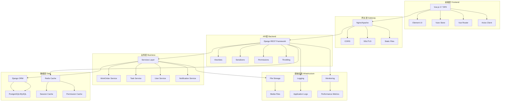
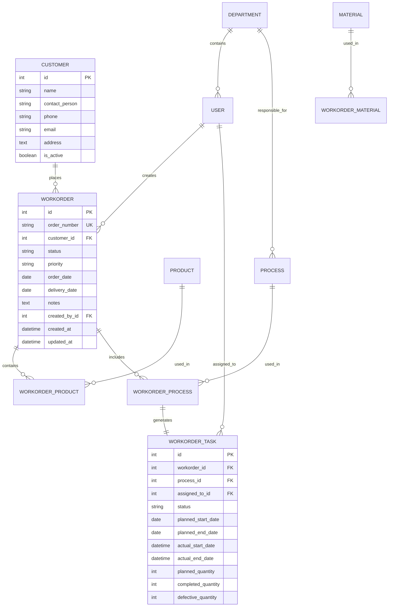
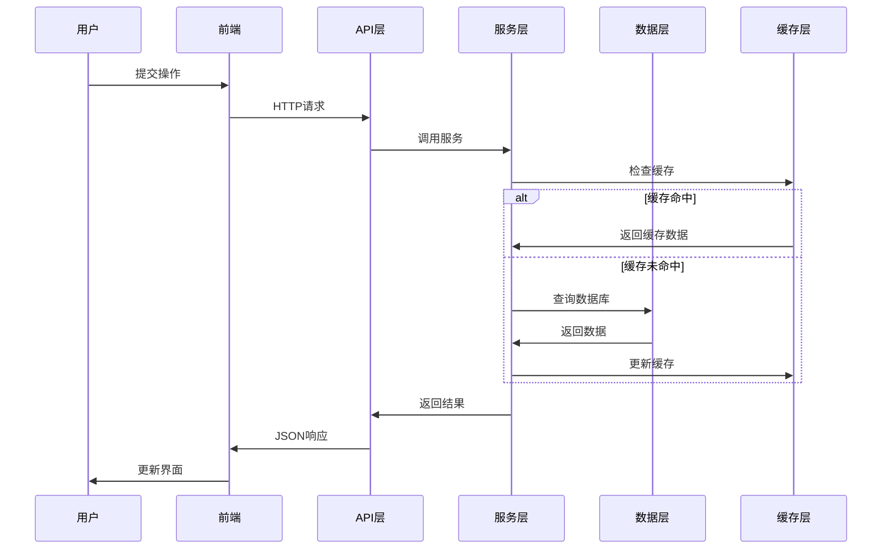
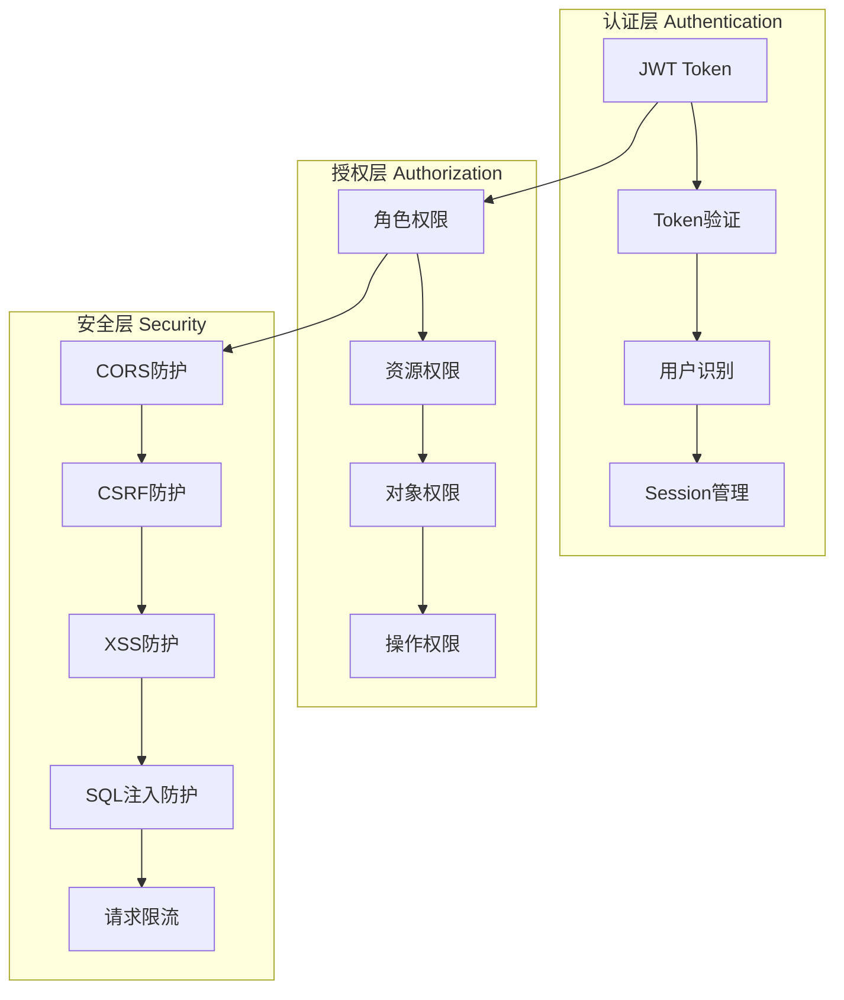
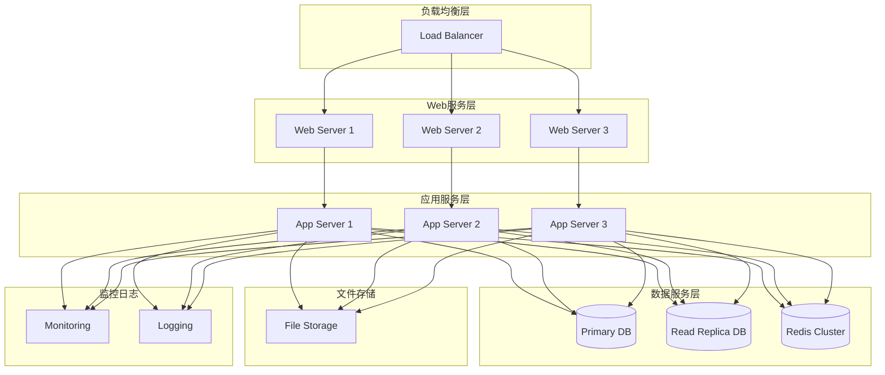
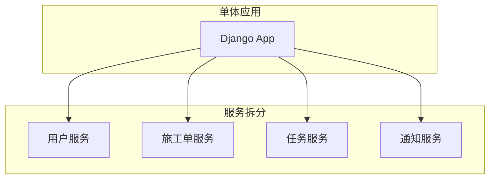
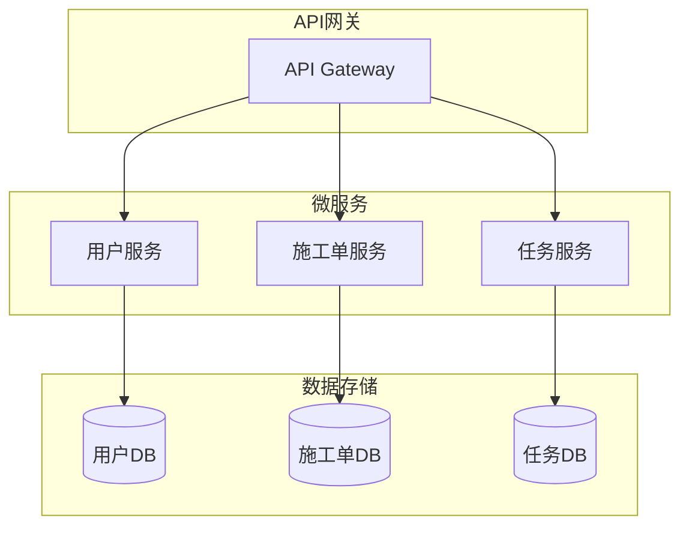

# 系统架构文档 - 印刷施工单跟踪系统

> 版本：v2.0.0  
> 更新时间：2026-01-17

## 📋 目录

- [架构概览](#架构概览)
- [技术架构](#技术架构)
- [数据架构](#数据架构)
- [安全架构](#安全架构)
- [部署架构](#部署架构)
- [性能架构](#性能架构)
- [扩展架构](#扩展架构)

## 🏗️ 架构概览

### 系统定位

印刷施工单跟踪系统是一个面向印刷企业的生产管理平台，支持从接单到交付的全流程数字化管理。

### 核心特性

- 🎯 **全流程管理**：从客户接单到产品交付的完整流程
- 🔐 **权限控制**：细粒度的权限管理和角色控制
- 📊 **实时监控**：生产进度实时跟踪和统计分析
- 🔄 **工作流**：基于状态机的工作流管理
- 📱 **响应式**：支持多终端访问的响应式设计

### 架构原则

1. **模块化设计**：按业务领域划分模块，降低耦合度
2. **前后端分离**：清晰的API接口，独立部署和扩展
3. **微服务就绪**：模块化设计便于后续微服务化改造
4. **安全优先**：多层安全防护，数据安全保障
5. **性能优化**：缓存策略和性能监控

## 🛠️ 技术架构

### 整体架构图



### 技术栈详情

#### 前端技术栈

| 技术 | 版本 | 用途 | 说明 |
|------|------|------|------|
| Vue.js | 2.7.16 | 前端框架 | Composition API |
| Element UI | 2.15.14 | UI组件库 | 企业级组件库 |
| Vue Router | 3.6.5 | 路由管理 | 单页应用路由 |
| Vuex | 3.6.2 | 状态管理 | 全局状态管理 |
| Axios | 1.6.2 | HTTP客户端 | API请求管理 |
| Jest | 29.7.0 | 测试框架 | 单元测试 |

#### 后端技术栈

| 技术 | 版本 | 用途 | 说明 |
|------|------|------|------|
| Python | 3.11+ | 后端语言 | 主要开发语言 |
| Django | 4.2.9 | Web框架 | MVC架构 |
| Django REST Framework | 3.14.0 | API框架 | RESTful API |
| PostgreSQL | 14+ | 主数据库 | 生产环境数据库 |
| Redis | 7.0+ | 缓存数据库 | 缓存和会话存储 |
| Celery | 5.3+ | 任务队列 | 异步任务处理 |

### 前端架构

#### 组件架构

```
src/
├── components/           # 通用组件
│   ├── VirtualList/     # 虚拟列表组件
│   ├── LazyImage/       # 图片懒加载
│   └── ComponentLoading/ # 加载状态组件
├── views/               # 页面视图
│   ├── workorder/       # 施工单模块
│   ├── task/           # 任务模块
│   └── dashboard/      # 仪表板
├── services/           # 业务服务层
│   ├── WorkOrderService.js
│   ├── TaskService.js
│   └── UserService.js
├── api/                # API接口封装
├── store/              # Vuex状态管理
└── utils/              # 工具函数
```

#### 状态管理架构

```javascript
store/
├── index.js           # 根store配置
├── modules/
│   ├── user.js        # 用户状态
│   ├── workOrder.js   # 施工单状态
│   ├── task.js        # 任务状态
│   ├── ui.js          # UI状态
│   └── cache.js       # 缓存状态
└── plugins/
    ├── persist.js     # 持久化插件
    └── logger.js      # 日志插件
```

### 后端架构

#### Django应用架构

```
workorder/             # 主业务应用
├── models/           # 数据模型（分模块）
│   ├── __init__.py
│   ├── core.py       # 核心模型
│   ├── products.py   # 产品模型
│   ├── materials.py  # 物料模型
│   └── system.py     # 系统模型
├── views/            # API视图
│   ├── core.py       # 核心API
│   ├── products.py   # 产品API
│   └── materials.py  # 物料API
├── serializers/      # 序列化器
├── services/         # 业务服务层
├── permissions.py    # 权限控制
├── urls.py          # URL路由
└── admin.py         # 管理后台
```

#### 服务层架构

```python
services/
├── __init__.py
├── workorder_service.py    # 施工单业务逻辑
├── task_service.py         # 任务业务逻辑
├── user_service.py         # 用户业务逻辑
├── notification_service.py  # 通知服务
└── inventory_service.py    # 库存服务
```

## 🗄️ 数据架构

### 数据库设计

#### 核心实体关系



#### 数据分层

1. **持久层**：PostgreSQL数据库
2. **缓存层**：Redis缓存
3. **会话层**：Django Session Framework
4. **文件存储**：本地文件系统或云存储

#### 数据一致性

- **事务管理**：使用Django ORM事务
- **约束检查**：数据库约束 + 应用层验证
- **并发控制**：乐观锁机制
- **数据同步**：事件驱动的数据同步

### 数据流架构



## 🔐 安全架构

### 认证授权架构



### 安全措施

#### 认证机制
- **JWT Token认证**：无状态token认证
- **Token刷新**：自动token刷新机制
- **会话管理**：安全的会话存储和管理

#### 授权机制
- **RBAC模型**：基于角色的访问控制
- **细粒度权限**：对象级权限控制
- **权限缓存**：权限查询结果缓存

#### 数据安全
- **数据加密**：敏感数据加密存储
- **传输加密**：HTTPS/TLS传输加密
- **输入验证**：严格的数据验证和过滤

#### 网络安全
- **CORS配置**：跨域请求控制
- **CSRF防护**：跨站请求伪造防护
- **请求限流**：API请求频率限制

## 🚀 部署架构

### 部署架构图



### 部署策略

#### 容器化部署
```yaml
# docker-compose.yml
version: '3.8'
services:
  web:
    build: ./backend
    ports:
      - "8000:8000"
    depends_on:
      - db
      - redis
  
  frontend:
    build: ./frontend
    ports:
      - "80:80"
    depends_on:
      - web
  
  db:
    image: postgres:14
    environment:
      POSTGRES_DB: workorder
      POSTGRES_USER: workorder
      POSTGRES_PASSWORD: ${DB_PASSWORD}
    volumes:
      - postgres_data:/var/lib/postgresql/data
  
  redis:
    image: redis:7-alpine
    ports:
      - "6379:6379"
```

#### Kubernetes部署
```yaml
# deployment.yaml
apiVersion: apps/v1
kind: Deployment
metadata:
  name: workorder-backend
spec:
  replicas: 3
  selector:
    matchLabels:
      app: workorder-backend
  template:
    metadata:
      labels:
        app: workorder-backend
    spec:
      containers:
      - name: backend
        image: workorder/backend:latest
        ports:
        - containerPort: 8000
        env:
        - name: DATABASE_URL
          valueFrom:
            secretKeyRef:
              name: db-secret
              key: url
```

### 环境配置

#### 开发环境
- SQLite数据库
- 本地Redis
- 开发服务器
- 热重载支持

#### 测试环境
- PostgreSQL数据库
- Redis缓存
- 自动化测试
- CI/CD集成

#### 生产环境
- PostgreSQL主从复制
- Redis集群
- 负载均衡
- 监控告警

## ⚡ 性能架构

### 性能优化策略

#### 前端性能优化

1. **代码分割**
   ```javascript
   // 路由级别的代码分割
   const WorkOrder = () => import('@/views/workorder/List.vue')
   const Task = () => import('@/views/task/List.vue')
   ```

2. **虚拟滚动**
   ```vue
   <template>
     <VirtualList
       :items="largeDataList"
       :item-height="50"
       :container-height="400"
     />
   </template>
   ```

3. **图片懒加载**
   ```vue
   <template>
     <LazyImage
       :src="imageSrc"
       :placeholder="placeholder"
     />
   </template>
   ```

4. **缓存策略**
   ```javascript
   // API缓存配置
   const cache = new Map()
   const CACHE_TTL = 5 * 60 * 1000 // 5分钟
   ```

#### 后端性能优化

1. **数据库优化**
   ```python
   # 查询优化
   workorders = WorkOrder.objects.select_related(
       'customer', 'created_by'
   ).prefetch_related(
       'products', 'processes'
   ).all()
   ```

2. **缓存策略**
   ```python
   # 视图缓存
   from django.views.decorators.cache import cache_page
   
   @cache_page(60 * 15)  # 15分钟
   def dashboard_stats(request):
       # 统计数据缓存
       pass
   ```

3. **异步任务**
   ```python
   # Celery异步任务
   from celery import shared_task
   
   @shared_task
   def generate_report(workorder_id):
       # 耗时报告生成
       pass
   ```

### 性能监控

#### 关键指标监控
- **响应时间**：API平均响应时间
- **吞吐量**：每秒处理请求数
- **错误率**：请求失败率
- **资源使用**：CPU、内存、磁盘使用率

#### 监控工具
- **APM**：应用性能监控
- **日志分析**：日志聚合和分析
- **告警系统**：异常告警和通知

## 🔄 扩展架构

### 微服务化改造路径

#### 阶段一：服务拆分


#### 阶段二：API网关


### 扩展性设计

#### 水平扩展
- **无状态设计**：应用服务器无状态
- **数据库分片**：数据库水平分片
- **缓存集群**：Redis集群部署

#### 垂直扩展
- **模块化架构**：业务模块独立
- **插件系统**：功能插件化
- **配置管理**：外部化配置

### 未来技术演进

#### 技术升级路径
1. **Vue 3迁移**：Vue 2.7 → Vue 3
2. **Django升级**：Django 4.2 → Django 5.x
3. **数据库升级**：PostgreSQL 14 → PostgreSQL 16
4. **容器化**：Docker → Kubernetes

#### 新技术引入
1. **GraphQL**：替代REST API
2. **消息队列**：RabbitMQ/Kafka
3. **搜索引擎**：Elasticsearch
4. **云原生**：Service Mesh

## 📊 架构决策记录 (ADR)

### ADR-001: 前后端分离架构
**决策**：采用前后端分离架构
**理由**：
- 独立开发和部署
- 技术栈灵活选择
- API可复用性高
- 便于移动端扩展

### ADR-002: Django REST Framework
**决策**：使用DRF作为API框架
**理由**：
- 成熟的REST API框架
- 丰富的序列化器支持
- 完善的权限系统
- 良好的文档和社区支持

### ADR-003: Vue.js 2.7 + Composition API
**决策**：使用Vue 2.7 Composition API
**理由**：
- 向后兼容性好
- Composition API提升代码组织
- Element UI生态成熟
- 学习成本相对较低

### ADR-004: Redis缓存策略
**决策**：采用Redis作为缓存层
**理由**：
- 高性能内存数据库
- 丰富的数据结构
- 持久化支持
- 集群支持

## 🎯 架构质量属性

### 可用性 (Availability)
- **目标**：99.9%可用性
- **策略**：负载均衡、故障转移、健康检查

### 性能 (Performance)
- **目标**：API响应时间 < 200ms
- **策略**：缓存、数据库优化、CDN

### 可扩展性 (Scalability)
- **目标**：支持10倍用户增长
- **策略**：水平扩展、微服务架构

### 安全性 (Security)
- **目标**：零安全漏洞
- **策略**：多层防护、定期审计

### 可维护性 (Maintainability)
- **目标**：快速定位和修复问题
- **策略**：模块化设计、完善的日志

---

**文档版本：** v2.0.0  
**更新时间：** 2026-01-17  
**架构师：** 架构团队  
**审核人：** 技术总监